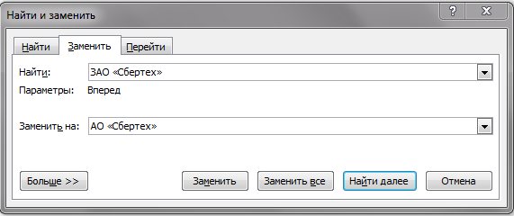

## Давным давно в одной...
!UWAGA! Не предназначено для программистов и прочих красноглазых

Сегодня я попробую рассказать о регулярных выражениях, одном из наиболее мощных инструментов для поиска
и автозамены в текстах. Подобные задачи возникают не так редко, как кажется. Кто недавно делал нечто подобное:



```sql
SELECT * FROM payments WHERE purpose LIKE "%налог%"
```

```bash
rm -rf todo*
```
Во всех примерах задаются шаблоны для сопоставления с текстом. В первом примере ищутся все вхождения шаблона
в текст и заменяются на другой шаблон. Во втором sql запрос выведет все строки таблицы, в которых
значение колонки purpose cоответствует шаблону целиком (т.е. содержит слово `налог`. В третьем
будут удалены файлы и папки, название которых целиком соответствует шаблону (т.е. начинается с `todo`)

Регулярные выражения как раз и представляют собой язык для задания подобных шаблонов, только более развитый.
Поэтому они позволяют накладывать более точные ограничения на искомый текст и решать более широкий круг
задач. Основные операции те же:
- *rlike / matches* - полное совпадение строки с шаблоном
- *find / findAll* - поиск вхождений шаблона в строке
- *replace / replaceAll* - замена найденных вхождений на другой шаблон

Перейдем к синтаксису. Любое слово представляет собой готовое регулярное выражение:
[простой шаблон](https://regex101.com/r/3Kt1rU/1).
Здесь уже используется первая операция: конкатенация (зацепление), соединяющая отдельные символы в шаблон.

Чаще, однако, приходится искать не просто определенное слово но и все его возможные формы.
Для этого понадобится операция `|` - "или" (чередование).
[Словоформы в шаблоне](https://regex101.com/r/b0Cp1r/1).
Приоритет чередования ниже, чем у зацепления. Поэтому необходимо использовать скобки
Обратите внимание, что шаблон применяется
слева направо. Если поменять "о" и "ом" местами, то матчинг успешно закончится на букве "о", а "м"
в результат матча не войдет, что нежелательно.
[Практикум словоформы](https://regex101.com/r/mUDIP8/1).
[Практикум даты](https://regex101.com/r/FlUbvY/1)

Попробуем теперь написать регулярное выражение для поиска номеров телефона.
[Телефон](https://regex101.com/r/Kb1q0T/1)
Выражение получается очень большим.
Не хватает чего-то похожего на умножение. В РВ для этого существуют кванторы или квантификаторы
[Практикум числа в тексте](https://regex101.com/r/DlJ9G1/1)

При большом количестве альтернативных символов регулярное выражения могут стать очень громоздкими, для
решения этой проблемы существуют символьные классы,

